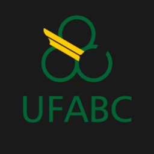

## Hello There
- I'm currently working as a **Data Storage Administrator at T-Systems do Brasil**, focused on SAN and NAS infraestructures.
  
  :technologist: My day-to-day involves managing block (HDS VSP), object storage (HDS HCP) and filesystems shares (HDS HNAS / Dell Unity), as well as SAN fabrics with Brocade switches.

  

           
           
  

  
  In my spare time, I'm developing a space :baseball: game called *Line Drive* (not public yet).

- I'm studying at *Universidade Federal do ABC (UFABC)*, pursuing a bachelor's degree in **Science and Technology and Computer Science** :man_student:.
   
- I’m currently learning ReactJS and improving my computer networking and OS skills (Oracle Linux).

- I’m looking to collaborate on software development projects that involves **game development** and **AI modeling**.

<!--
**mrmonkeypatch/mrmonkeypatch** is a ✨ _special_ ✨ repository because its `README.md` (this file) appears on your GitHub profile.

Here are some ideas to get you started:

- 🔭 I’m currently working on ...
- 🌱 I’m currently learning ...
- 👯 I’m looking to collaborate on ...
- 🤔 I’m looking for help with ...
- 💬 Ask me about ...
- 📫 How to reach me: ...
- 😄 Pronouns: ...
- ⚡ Fun fact: ...
-->
